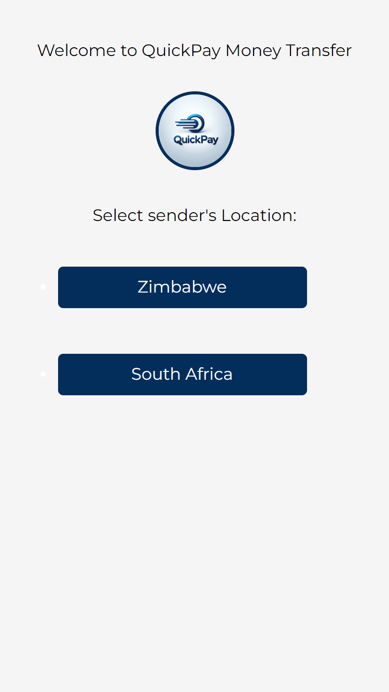
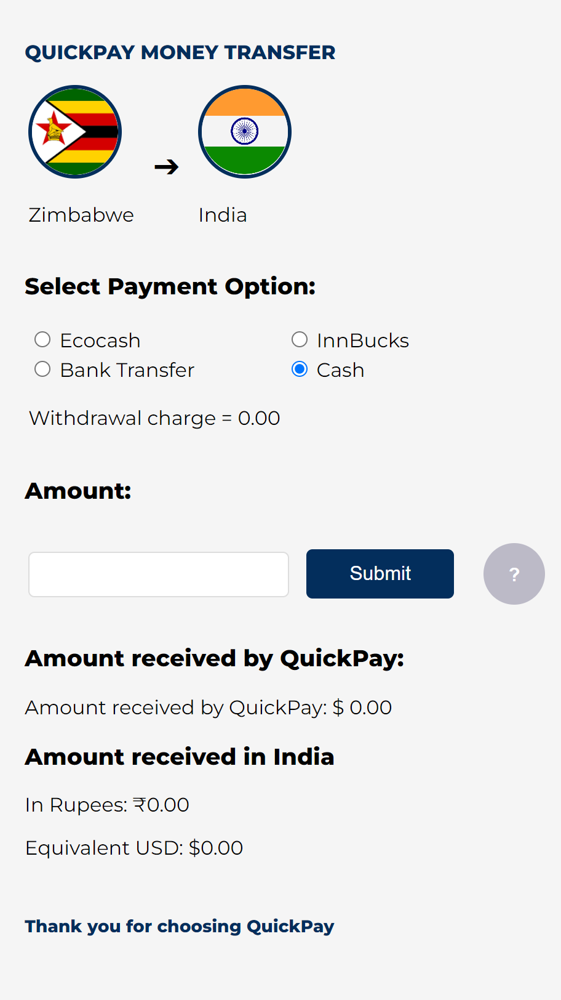

# quick-pay Currency Converter

Welcome to QuickPay Money Transfer Currency Converter! Our goal is to provide a convenient and user-friendly online platform for customers to get an instant quote for their foreign exchange (FX) transfer needs. We've developed this platform in collaboration with a reliable company that specializes in processing forex transfers from Zimbabwe or South Africa to India.

## Table of Contents

1. [Introduction](#quick-pay-currency-converter)
   - [Features](#features)
  
2. [Getting Started](#getting-started)
   - [Usage](#usage)
  
3. [Technologies Used](#technologies-used)
  
4. [Screenshots](#screenshots)
  
5. [Contributing](#contributing)
  
6. [License](#license)
  
7. [Contact](#contact)

## Features

QuickPay Money Transfer offers the following features:

- **Live currency conversion**: The platform converts the two base currencies (ZAR and NAD) to Indian Rupees (INR) with a markup specified by our partner.
- **Intuitive interface**: The website features a clean and modern design, making it easy for users to navigate and get instant quotes.
- **Compatibility**: The platform is compatible with modern web browsers, ensuring a seamless experience for all users.
- - Selection of payment options with corresponding withdrawal charges.
- Responsive design for optimal viewing on various devices.
- Help functionality to guide users through the conversion process.

## Getting Started

To use Quick Pay Converter, follow these steps:

1. Open your preferred web browser and navigate to the website: [https://www.quick-pay.github.io](https://quick-pay.pages.dev)
2. Enter the required details, such as the amount you want to transfer, your preferred currency conversion, and your contact information.
3. Click the "Convert" button to generate an instant quote for your transfer.

## Technologies Used

The Quick Pay Converter website is built using the following technologies:

- HTML
- CSS
- JavaScript

## Screenshots

## Contributing

We welcome any contributions or suggestions to improve the platform. If you have any questions or want to report any issues, please feel free to open an issue on this repository.

## License

This project is licensed under the MIT License - see the [LICENSE](LICENSE) file for details.

## Contact
Developer: Ownuh Melds
Email: leonakokerai@outlook.com
WhatsApp: +91 86 997 58198
